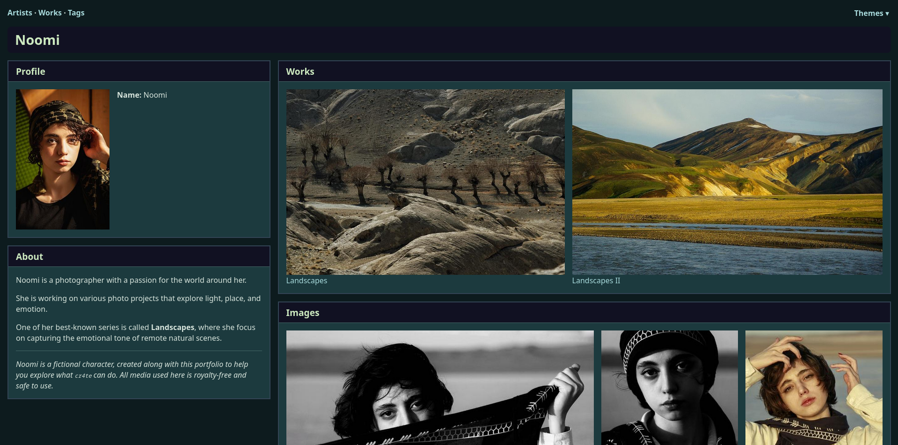

# cr4te

> **⚠️ Under Construction**
> This project is still in development. Features, structure, and configuration may change without notice.

A fast, static site generator for organizing and showcasing media collections.

cr4te scans your existing folder structure, extracts metadata and media (images, videos, audio, documents), and generates clean, responsive HTML galleries. With built-in search, tagging, filtering, and pagination, it's ideal for archiving, browsing, or publishing rich media portfolios—no manual curation or database required.



[View full gallery](SCREENSHOTS.md)

## Support This Project 🙏

If you find cr4te useful, consider [donating via PayPal](https://www.paypal.com/donate/?hosted_button_id=XERA3ZMTLZC2N) to help support continued development.

---

## Features

* **Automatically builds a gallery website** from your existing folder structure (e.g. directors and movies)
* **Dedicated overview pages with filter and tag-aware search**
* **Video, audio, image, and document organization with dynamic labels**
* **HTML label presets for different domains** (art, music, books, film, ...)
* **User-customizable labels and media rules** via optional config file
* **Fast static HTML output** with no runtime dependencies during browsing
* **Theme switcher with persistent selection** using localStorage

> This tool is an ongoing work-in-progress. Expect improvements, breaking changes, and new features.

---

## Example Folder Structures

Your folder structure should follow a nested, hierarchical format that reflects creators and their projects. For example:

```
Domain/
├── Alice/
│   └── Project1/            # Media folder (images, videos, documents,...)
├── Bob/
└── Bob & Charlie/           # Collaboration folder
    └── ProjectZ/            # Media folder
```

This could represent domains like:

* **Music** → Musician → Album
* **Library** → Author → Book
* **Movies** → Director → Film
* **Design Portfolios** → Designer → Project

...and so on.

Each leaf folder (e.g., Project1, ProjectZ) contains the media and optional metadata used to build the final site.

## Installation

```bash
git clone https://github.com/vger-6/cr4te.git
cd cr4te
pip install -r requirements.txt
```

---

## Usage

### Generate JSON Metadata and Build HTML site

See also the [Quick-Start](https://github.com/vger-6/cr4te/blob/main/data/example#quick-start) which includes a step-by-step guide using example data.

> **⚠️ Note**
> cr4te.json files are automatically generated by the build command and saved directly into each creator’s original folder (e.g., <input_folder>\*/cr4te.json). These files can be manually edited to override or extend metadata such as birth dates, aliases, tags, or project descriptions.

> **⚠️ Note**
> Ensure that `<output_folder>` does not already exist, as it will be deleted!

```bash
python cr4te.py build -i <input_folder> -o <output_folder>
```

### Optional: Custom Configuration

```bash
python cr4te.py build -i <input_folder> -o <output_folder> --config path/to/my_config.json
```

### Optional: Apply a Label Preset

```bash
python cr4te.py build -i <input_folder> -o <output_folder> --label-preset film
```

Available presets:

* `art` (default)
* `film`
* `music`
* `book`

If `--config` is not specified, cr4te uses internal defaults.

Additional options:

* `--max-images` — Set maximum images per media group (overrides config)
* `--image-sample-strategy` — Image selection strategy: `spread` (default), `head`, `all`
  * `spread` (default): even sampling throughout the list
  * `head`: take the first N images
  * `all`: take all images

If `--image-sample-strategy all` is used `--max-images` has no effect.

---

## Configuration

Your configuration file should be in JSON format and can override labels and media matching rules.

### Special Rules

* `creator_page_visible_creator_fields`: Controls which creator attributes (e.g., `aliases`, `nationality`) are shown
* `project_page_visible_project_fields`: Controls which project attributes (e.g., `release_date`) are shown

---

## Creator Metadata: `cr4te.json`

Each creator folder must contain a `cr4te.json` file.
The `cr4te.json` files are automatically generated by the `build-json` sub command but can also be edited by hand.

See this [`cr4te.json`](https://github.com/vger-6/cr4te/blob/main/data/example/Artists/Noomi/_cr4te.json) file from the example.

### Editable Fields (excerpt)

* `born_or_founded`: Must be in `YYYY-MM-DD` format
* `active_since`: Must be in `YYYY-MM-DD` format
* `nationality`: Any free-form text
* `aliases`: List of alternate names
* `info`: Optional bio text (supports Markdown)
* `tags`: Format should be `Category:Tag`, e.g. `Occupation:Photographer` or just `Photographer`
* `projects[*].info`: Optional per-project description
* `projects[*].tags`: Tag list for each project
* `members`: If this is a group folder, add member names
* `collaborations`: Add collaboration names

---

## Output Example

* `index.html` — Overview page
* `projects.html` — Projects overview page
* `creators/<creator>.html` — Individual profile pages
* `projects/<project>.html` — Individual project pages
* `tags.html` — Browse by tags

Thumbnails are automatically generated into `/thumbnails/`.

---

## Requirements

* Python 3.10+
* Pillow
* Markdown
* Jinja2
* Pydantic

Install dependencies:

```bash
pip install -r requirements.txt
```

---

## Troubleshooting

### LocalStorage not Working Under `file://`

Some browsers (notably Firefox with strict settings) block `localStorage` access across pages loaded with the `file://` protocol.

**Solution:** run a lightweight local server from your output folder:

```bash
cd /path/to/OutputFolder
python3 -m http.server 8000
```

Then open `http://localhost:8000/` in your browser.

This will fix localStorage issues and better match how your site behaves when deployed online.

---

### Building HTML Pages Not Working?
If running the `build-html` command doesn't work or fails silently, it may be due to insufficient file permissions. Try running the command with administrator privileges (e.g., using sudo on Unix-based systems or an elevated Command Prompt on Windows).

Also, ensure:
* The output directory is writable.
* All required dependencies are installed.

## License

This project is licensed under the terms of the LICENSE file included.

---

## TODO

This section outlines planned improvements, refactors, and feature ideas for `cr4te`.

### 🔧 Functionality

- [ ] Add `--dry-run` flag to `build-json` and `build-html` commands
- [ ] Add optional progress bar (e.g., using `tqdm`) for large folder trees
- [ ] Enable post-processing via custom hooks (e.g., metadata or templating)

### 📄 Output & Layout

- [ ] Extract shared CSS styles for customization (or theme overrides)
- [ ] Split CSS files into modular components (e.g., layout, buttons, gallery)

### 🧹 Refactoring

- [ ] Consider internal mapping for config fields (e.g., `"creator_page_visible_creator_fields"`)

### 🧪 Testing & Docs

- [ ] Add unit tests
- [ ] Add more professional logging (with support for `--verbose`)

---

## Credits

Created for artists, curators, media historians, and creative developers who want simple but structured control over their digital media archives.

> Development is ongoing. Feedback, ideas, and contributions are very welcome!
 
