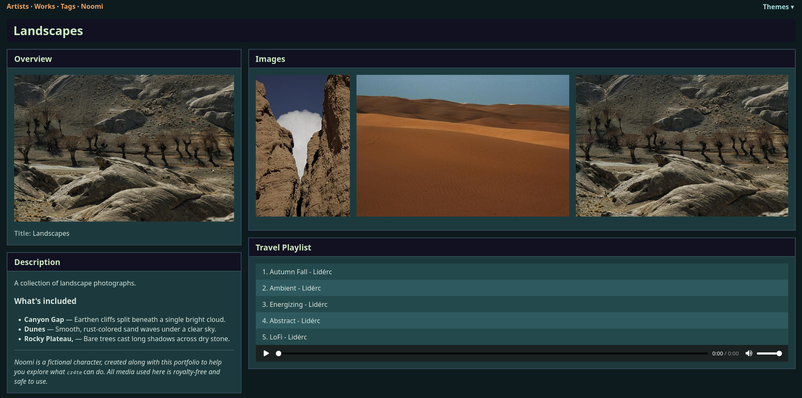

# Example Media for cr4te

This folder contains example content to help new users get started quickly with [`cr4te`](https://github.com/vger-6/cr4te), a tool for generating media-rich HTML pages from structured content.

* Royalty-free images
* Sample audio tracks
* Hand-crafted documents

## Table of Contents

* [Contents](#contents)
* [Quick-Start](#quick-start)
* [Step-by-Step Guide](#step-by-step-guide)
* [License & Usage](#license--usage)
* [Attribution](#attribution)

## Contents

* `images` — Royalty-free photos from [Pixabay](https://pixabay.com/)
* `audio` — Royalty-free MP3 tracks from [Pixabay](https://pixabay.com/)
* `documents` — Sample PDF files and other assets created specifically for this demo

## Quick-Start

Using the example content and *cr4te*, we are going to build HTML pages that look similar to this:



## Step-by-Step Guide

### Step 1: Install cr4te

> **⚠️ Note**
> It is recommended to create a virtual environment first.

Clone the repository and install dependencies:

```bash
git clone https://github.com/vger-6/cr4te.git
cd cr4te
pip install -r requirements.txt
```

### Step 2: Generate JSON Metadata and Build HTML Site

> **⚠️ Note**
> `cr4te.json` files are automatically generated by the `build-json` command and saved directly into the original folders (e.g., `/path/to/cr4te/example/data/Artists/Noomi/cr4te.json`).

> **⚠️ Note**
> Ensure that `<output_folder>` does not already exist, as it will be deleted!

Generate JSON metadata from your media folder and build the HTML site:

```bash
python cr4te.py build -i example/data/Artists -o <output_folder> --open
```

E.g. replace `<output_folder>` with `example/data/out`

## License & Usage

* **Pixabay Media**: Images and audio files in this folder are sourced from [Pixabay](https://pixabay.com/), and are released under the [Pixabay License](https://pixabay.com/service/license/), which allows free use for commercial and non-commercial purposes without attribution.
* **Other Files**: All non-Pixabay media in this folder (e.g., PDF files) were created by the author of this project and are released under the MIT License unless otherwise noted.

## Attribution

Attribution is not required, but feel free to credit Pixabay or the original creators if you wish.

---

